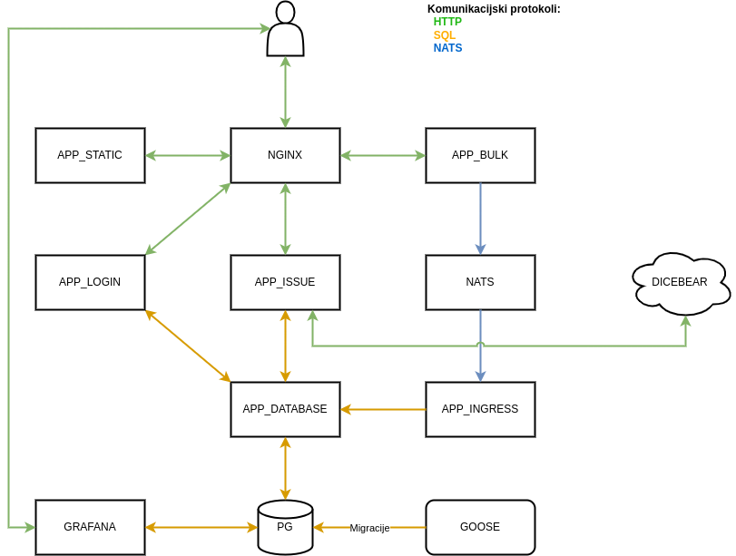
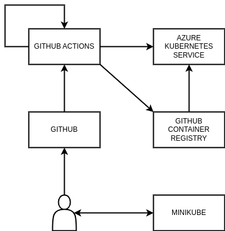
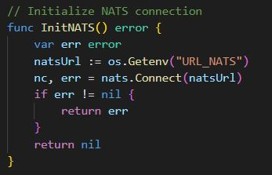
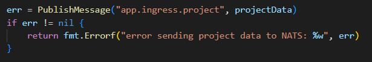
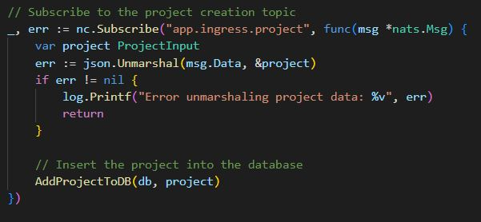
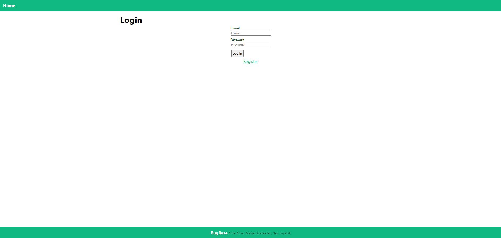
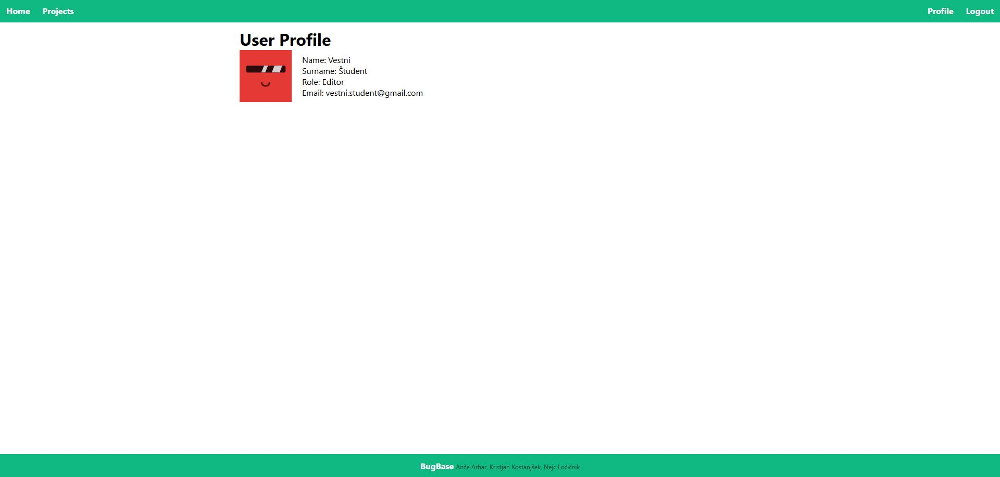
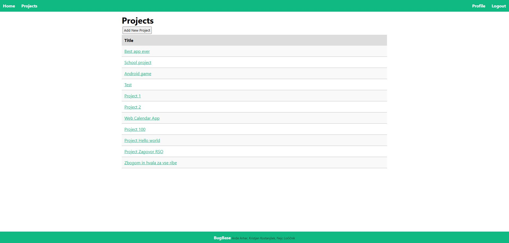

# Naslov Projekta: BugBase

# Člani in številka skupine

Skupina 22:
- Anže Arhar
- Kristjan Kostanjšek
- Nejc Ločičnik

# Povezava do repozitorija

[GitHub link](https://github.com/RSOPMS)

# Naslov URL, kjer je aplikacija dostopna (in morebitni testni prijavni podatki)

[BugBase](http://72.146.53.48/login/)

# Kratek opis projekta

BugBase je aplikacija za vodenje in upravljanje projektov, zasnovana za razvijalce, ki se pogosto soočajo s kompleksnimi projekti in potrebujejo pomoč pri organizaciji.
Poleg registracije in prijave omogoča dodajanje novih projektov in spremljanje njihovega napredka, pri čemer lahko pod vsak projekt dodajamo naloge (issues), ki jih je mogoče povezati z razvojnimi vejami, določiti prioriteto (npr. High, Low) ter spremljati njihovo stanje (npr. Open, Closed).
Poleg tega aplikacija podpira dodajanje komentarjev k posameznim nalogam, kar olajša sodelovanje in komunikacijo znotraj ekip.

# Ogrodje in razvojno okolje

V skopu razvoja, izdelave in zagona aplikacije smo uporabili naslednja programska ogrodja, orodja, razvojna okolja ter storitve.
Celotna aplikacija je napisana v programskem jeziku go.
Za osnovno delovanje storitev smo uporabili le standardno knjižnico.
Dodatno smo namestili štiri knjižnice: [joho/godotenv](https://github.com/joho/godotenv) za branje okoljskih spremenljivk iz `.env` datotek; [lib/pq](https://github.com/lib/pq) sql gonilnik za PostgreSQL podatkovno bazo; [golang-jwt/jwt](https://github.com/golang-jwt/jwt) kot osnovno implementacijo JWT standarda; [nats-io/nats.go](https://github.com/nats-io/nats.go) za pošiljanje in branje sporočil iz NATS strežnika.
Za interaktivno delovanje spletnega dela aplikacije (API klici in preusmeritve uporabnikov) smo uporabili ogrodje [htmx](https://htmx.org/).
Orodje `make` smo uporabili za organizacijo in uporabo pogosto uporabljenih ukazov (postavljanje razvojnega okolja, migracije podatkovne baze, ...).
Z orodjem [air](https://github.com/air-verse/air) smo lokalno poganjali strežnike.
Migracije (in testne podatke) na podatkovni bazi smo upravljali z orodjem [goose](https://github.com/pressly/goose).
Za iskanje napak v aplikaciji smo uporabljali orodje [delve](https://github.com/go-delve/delve).
Vsako storitev smo pretvorili v samostojno datoteko in jo namestili v lasten Docker vsebnik.
S Kubernetesom smo zagotovili visoko razpoložljivost izdelanih vsebnikov.
Lokalno testiranje konfiguracije Kubernetesa znotraj okolja Docker nam je omogočilo orodje [minikube](https://minikube.sigs.k8s.io/docs/).
Za komunikacijo med nekaterimi storitvami smo tudi uporabili [NATS](https://nats.io/).
Za spremljanje osnovnih statistik podatkovne baze smo namestili orodje [Grafana](https://grafana.com/).
Izdelavo `CHANGELOG.md` datoteke, kjer so zapisane ključne spremembe izvorne kode, je omogočilo orodje [git-cliff](https://github.com/orhun/git-cliff).
Vso izvorno kodo smo hranili na platformi GitHub.
Tam smo tudi izvajali zvezno integracijo in zvezno dostavo s GitHub actions.
Izdelane Docker vsebnike smo hranili na GitHub-ovi platformi GitHub Container Registry.
Vse verzije aplikacije smo poganjali na Azure Kubernetes Service.

# Shema arhitekture

# Seznam funkcionalnosti mikrostoritev

V pričujočem poglavju bomo za vsako mikrostoritev navedli funkcionalnosti, ki jih implementira.

## database

Po meri nadgrajena slika PostgreSQL podatkovne baze.
Ob zagonu se avtomatično namestijo ključne nadgradnje (migracije) podatkovne baze.
Prav tako smo implementirali avtomatično namestitev testnih podatkov.

## app-static

TODO

## app-issue

TODO - Nejc

## app-login

TODO - Nejc

## app-bulk

Mikrostoritev omogoča prejemanje večje količine podatkov (novih projektov in nalog) preko POST zahtevka in pošiljanje prejetih podatkov mikrostoritvi app-ingress preko sporočilnega sistema NATS

## app-ingress

Mikrostoritev omogoča prejem podatkov (novih projektov in nalog) od mikrostoritve app-bulk preko sporočilnega sistema NATS in vstavljanje prejetih podatkov v podatkovno bazo.

# Primeri uporabe

Aplikacija podpira številne primere uporabe.
Uporabniki se lahko registrirajo ali prijavijo z obstoječim računom, pregledujejo sezname projektov, nalog, ki spadajo pod posamezne projekte, ter komentarje, povezane z njimi.
Poleg tega lahko ustvarjajo nove projekte, naloge in komentarje, dostopajo do svoje profilne strani ter se po potrebi odjavijo iz aplikacije.

Aplikacija podpira tudi kompleksnejši primer uporabe, pri kateri sodelujeta dve mikrostoritvi.
V podatkovno bazo je mogoče preko POST zahtevka uvoziti večje količine podatkov (projektov in nalog).
Mikrostoritev app-bulk prejme zahtevek in podatke posreduje mikrostoritvi app-ingress prek sporočilnega sistema NATS.
Mikrostoritev app-ingress nato poskrbi za shranjevanje teh podatkov v podatkovno bazo.

# Seznam vključenih zahtev

TODO: Za vsako zahtevo na kratko (okvirno do 500 znakov) opišite kako ste zahtevo implementirali/naslovili. Lahko vključite tudi slike. (Jaz sem napisal kar vse, treba je pobrisat tiste, ki jih nimamo).

## 1. Repozitorij

Za razvoj aplikacije smo uporabili GitHub repozitorij, ki smo ga ustrezno strukturirali in opremili za lažjo uporabo.
V repozitorij smo vključili datoteko README, ki vsebuje podrobna navodila za lokalno namestitev projekta.
Uporabili smo strategijo razvejanja, pri čemer smo ustvarili ključne veje, kot so main in dev.
Poleg tega smo za organizacijo, usklajevanje, deljenje dela med člani ekipe in inspiracijo uporabljali GitHub Issues.

## 2. Mikrostoritve in "cloud-native aplikacija"

Aplikacija je zasnovana za delovanje v oblačnem okolju, torej aplikacijo smo ločili na šibko sklopljene mikrostoritve, katere poganjamo v Docker vsebnikih in orkestriramo z orodjem Kubernetes.
Aplikacijo sestavlja šest mikrostoritev, katere smo omenili in opisali v poglavju Seznam funkcionalnosti mikrostoritev.

## 3. Dokumentacija

V GitHub repozitorij smo vključili markdown datoteko README, ki vsebuje vsa navodila za lokano namestitev aplikacije.
Prav tako smo vsaki izmed uporabljenih mikrostoritev dodali README datoteko, ki vsebuje navodila za lokalno namestitev in zagon zgolj te komponente.

## 4. Dokumentacija API

TODO - Nejc

## 5. Cevovod CI/CD

TODO

## 6. Helm charts

TODO - Nejc

## 7. Namestitev v oblak

TODO

## 8. "Serverless" funkcija

TODO - Nejc

## 9. Zunanji API

TODO - Nejc

## 10. Večnajemništvo

TODO - Nejc

## 11. Preverjanje zdravja

TODO

~~## 12. GraphQL in gRPC~~

## 12. Sporočilni sistemi

V aplikaciji uporabljamo sporočilni sistem NATS, zaradi njegove lahkosti in preprostosti uporabe.
Ob zagonu aplikacije se zažene NATS strežnik, na katerega se povežeta mikrostoritvi app-bulk in app-ingress.
App-bulk deluje kot producent in objavlja sporočila.
App-ingress pa deluje kot prejemnik in se naroči na teme, preko katerih prejema sporočila.
Prilagamo še slike izsekov programske kode, kjer vzpostavimo povezavo z NATS strežnikom, objavimo sporočilo s sistemom NATS in se naročimo na sporočila s sistemom NATS.

~~## "Event sourcing" in CQRS~~

~~## Centralizirano beleženje dnevnikov~~

## 13. Zbiranje metrik

TODO

## 14. Izolacija in toleranca napak

TODO

## 15. Upravljanje s konfiguracijo

TODO - Nejc

## 16. Grafični vmesnik

Za aplikacijo smo razvili grafični vmesnik in implementirali podstrani kot so: domača stran, prijavna stran, profilna stran, stran za pregled obstoječih projektov...
Za izdelavo grafičnega vmesnika nismo uporabili nobenih orodij, temveč smo ga izdelali samostojno.
Za povezavo sprednjega dela z zalednim, smo uporabili HTMX, ki omogoča vračanje predlog podatkov v obliki HTML, brez potrebe po nadaljnjem urejanju.
Prilagamo še nekaj primerov GUI nekaterih izmed podstrani naše aplikacije.

~~## Terraform~~

~~## API Gateway~~

TODO

## 17. Ingress Controller

TODO

~~## IAM, OAuth2, OIDC~~
